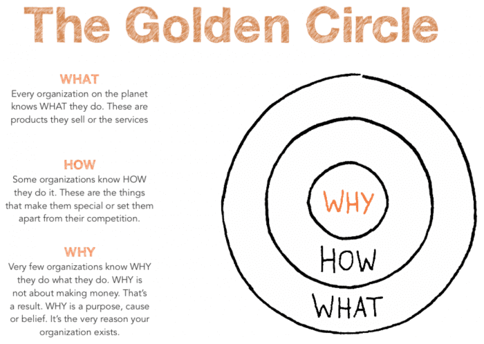

# Welcome




## Why
费曼学习法

## How
常见blog系统及技术
```text
1. WordPress
2. Typecho
3. Ghost
4. Jekyll
5. Hugo --> go
6. Hexo --> Node.js
7. Halo -->java
```
但是python+markdown才是我的选择，所以使用MKDocs
本站使用MkDocs搭建,使用 ~~Material theme~~ [mkdocs-simple-blog主题](https://github.com/FernandoCelmer/mkdocs-simple-blog)
For full documentation visit [mkdocs.org](https://www.mkdocs.org).
## What

* 记录日常折腾的点点滴滴
* 记录学习笔记
* 记录一些有意思的东西
* 记录一些有用的工具
* 存放一些文件、图片
* 转载一些精彩的文章（声明文章出处
* ...


# 附录

> 引言
在无纸化信息处理的流程中，信息输入、信息整理阶段的工具选择已经很多了，雨后春笋般不断浮现的笔记工具让人眼花缭乱。但到了信息输出和展示的环节——例如发表自己的读书心得、思考或是学习笔记，或是为自己的软件项目撰写文档——现有解决方案则总有明显的遗憾之处。

一方面，如果选择语雀、Notion 这样的第三方云端文档平台来存放，定制空间就很有限，且数据始终是寄人篱下。另一方面，如果选择 WordPress 这类 CMS 或近年流行的 Jekyll、Hugo 或是 Hexo 等「静态网站生成器」，随之而来的技术门槛和复杂操作又容易打消人的创作和分享热情。

以我个人为例，我想通过搭建简单的静态网站来很好地展示我在学习编程过程中的所作的笔记、对问题的看法等，将它们作为一个 Cookbook 或系统化的参考文档来使用，同时也兼具美观和可读性。对此，上述主流框架都有些「杀鸡用牛刀」的感觉，那么，有没有更好的方式呢？

我遇见的答案是 MkDocs。

文章来源 ：https://sspai.com/prime/story/mkdocs-primer
